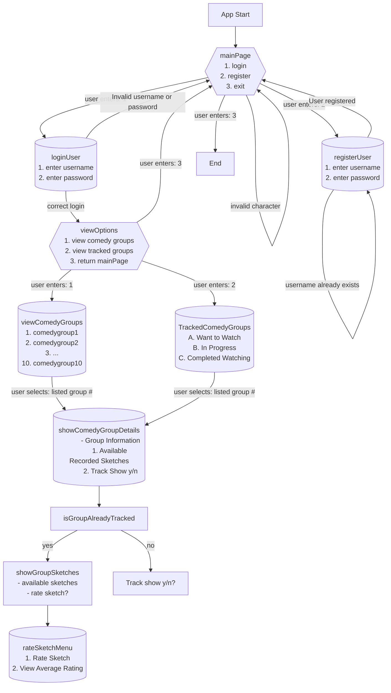

# LaughTrack
LaughTrack is a Java-based application designed to help users track and rate sketch comedy groups and their shows. The application provides an intuitive console-based menu for user registration/login, viewing comedy group information, rating sketches, and tracking watched content.

## Console Menu Layout

### Main Menu

1. **Login/Register**
    - Prompts the user to log in or register.
    - **If login is successful**, the user is taken to the User Tracking Menu.
    - **If login is unsuccessful**, a "Try Again..." message is displayed.
    - **If registering**, the user is taken to the registration form.
    - Allows the user to exit to the main menu without login/register.

2. **LaughTrack Summary and Info**
    - Displays a summary and information about LaughTrack.

### Sketch Comedy Groups Menu

1. **List Comedy Groups**
    - Displays a list of sketch comedy group names with their current overall (weighted) rating.
    - Allows the user to select a group to view details.

### Individual Sketch Group Menu

1. **Group Information**
    - Displays the name and summary description of the comedy group.

2. **Available Recorded Sketches**
    - Lists available recorded sketches to rate.
    - Displays the current average rating based on users who have marked them as "watched."

3. **Track Show**
    - Adds the show to the user's "Tracked Comedy Groups" if logged in and redirects to the comedy group tracking menu.
    - If the group is already being tracked, it automatically goes to the user's group tracking menu.
    - Prompts login/register if not logged in.

### User Tracking Main Menu

1. **Tracked Comedy Groups**
    - Lists current tracked sketch groups under categories "Want to Watch," "In Progress," and "Completed Watching."
    - **In Progress**: Shows the percentage of sketches marked as watched.
    - **Completed Watching**: Indicates completion.
    - **Want to Watch**: Indicates not started.
    - Display the groups' current rating based on the average of the sketches watched ratings.
    - Allows selection of a group to view tracking details.

### User Group Tracking Menu

1. **Group Information**
    - Displays the name and summary description of the comedy group.

2. **Available Recorded Sketches**
    - Lists available recorded sketches.
    - Each sketch allows the user to mark it as 'Watched' and rate it from 1-5.


## Repo Strucutre

```
LaughTrack/
│
├── src/
│   └── main/
│       ├── java/
│       |   └──com/
│       |       └── trackerapp/
│       |           ├── dao/
│       |           │   ├── UserDao.java
│       |           │   ├── ComedyGroupDao.java
│       |           │   ├── SketchDao.java
│       |           │   ├── UserRatingsDao.java
│       |           │   └── UserTrackedGroupDao.java
│       |           │
│       |           ├── models/
│       |           │   ├── User.java
│       |           │   ├── ComedyGroup.java
│       |           │   ├── Sketch.java
│       |           │   ├── UserRatings.java
│       |           │   └── UserTrackedGroup.java
│       |           │
│       |           ├── services/
│       |           │   ├── UserService.java
│       |           │   ├── ComedyGroupService.java
│       |           │   ├── SketchService.java
│       |           │   ├── UserRatingsService.java
│       |           │   └── UserTrackedGroupService.java
│       |           │
│       |           ├── utils/
│       |           │   ├── DatabaseConnection.java
│       |           │   └── ScannerInput.java
│       |           │
│       |           └── Main.java
│       │
|       ├── resources/
|       |   └── db.properties
|       |
|       └── webapp/
|
├── target/
├── pom.xml
└── README.md
```

### Database ER diagram


### App Flowchart


### Mermaid Code
[mermaid flowchart code:](https://mermaid.live/edit)


